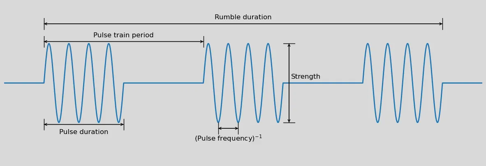

# Rumbler

A mod for [Beat Saber](https://beatsaber.com/) that lets you choose exactly how
you want your controllers to vibrate or "rumble" while playing.

## Why?

After Beat Saber v1.29.1, the game completely changed how controller rumble
worked. In the old version of the game, controller rumble was done as a series
of short pulses, while newer versions appear to just vibrate the controller at
a constant frequency. I thought the new behavior was particularly unpleasant on
my Valve Index controllers, and there are no built-in options to change the
controller rumble parameters.

## Features

You can specify separate rumble parameters for each of these:

- Normal notes
- Chain start notes (short normal)
- Chain link notes (short weak)
- Bomb
- Bad cut
- Obstacles (walls)
- Sliders (arcs)
- Saber clash
- UI bumps

For each of the above, you can specify the following parameters:

- Strength
- Rumble duration (not applicable to obstacles, sliders, and saber clashing)
- Pulse frequency
- Pulse duration
- Pulse train period

## Caveats

- This has only been tested on the Valve Index controllers, YMMV with other controllers!
